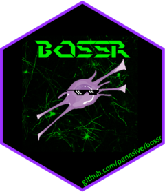

<!-- README.md is generated from README.Rmd. Please edit that file -->

# bossr <a href="https://pennsive.github.io/bossr/"></a>

<!-- badges: start --
[](https://cran.r-project.org/package=pkgdown){.pkgdown-release}
[](https://github.com/r-lib/pkgdown/actions){.pkgdown-devel}
[](https://app.codecov.io/gh/r-lib/pkgdown?branch=main)
 badges: end -->

[](https://github.com/pennsive/bossr/actions?workflow=R-CMD-check)

`bossr` consists of functions for automated segmentation of
oligodendrocytes in 2D, 3D and 4D arrays. [FAST](https://https://www.eneuro.org/content/early/2025/01/08/ENEURO.0025-24.2024) model inherits the `bossr` with its pre-configured parameters. 

## Installation

<!--
To install the released version:

```r
# Install released version from our drat repository
install.packages("bossr", repos='https://pennsive.github.io/drat')
```
-->

To install the development version:

``` r
devtools::install_github('pennsive/bossr')
```

## Usage

For an introduction to the `bossr` pipeline, check out the [main article
in our pkgdown
site](https://pennsive.github.io/bossr/articles/bossr.html).

A companion data package, `bossrdata`, is available to enable users to
follow along the examples in the main article. See the article for more
information on how to install `bossrdata`.

References to the main functions can be found
[here](https://pennsive.github.io/bossr/reference/index.html).

## Getting help

To get help [submit an issue on the GitHub
repository](https://github.com/PennSIVE/bossr/issues).


## References

If you use the `bossr`, please cite the following papers: Bae, Eunchan, et al. "FAST: Fast, free, consistent, and unsupervised oligodendrocyte segmentation and tracking system." eNeuro (2025).

